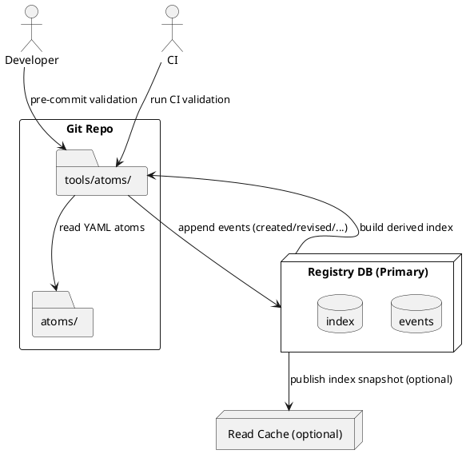

# SPEC-001-Two-ID Atomic Workflow Registry (DB-Backed)

## Background

Enterprises running multi-agent code pipelines, CI/CD flows, and parallel workflow orchestration often rely on single numeric IDs for task tracking. As repositories scale to tens of thousands of tasks and multiple teams iterate independently, those IDs collide, become brittle during refactors (reorders/splits/merges), and break cross-workflow links. Auditability also suffers because history is scattered and mutable.

The Two-ID System addresses these pain points by introducing:
- A **permanent, opaque `atom_uid`** (ULID/UUIDv7) for machine-stable identity and dependency links.
- A **structured, human-readable `atom_key`** for contextual sorting, reviews, and documentation.
- An **append-only registry** as an immutable event ledger with a **database-backed** store plus a derived index for fast reads.
- A **canonical atom YAML schema** enabling deterministic validation, automation, and lifecycle operations.
- **Namespacing/versioning rules** that isolate teams and workflows while preserving cross-workflow dependencies via UIDs.

Assumptions: Git-hosted repos; Python 3.11+ tooling; ULID primary; DB-backed ledger; signing is **recommended (warn-only)**.

---

## Requirements

### Must Have (M)
- Two-ID identity model (`atom_uid` ULID/UUIDv7; `atom_key` regex-compliant).
- One YAML file per atom; schema-validated.
- Dependencies via `atom_uid` only.
- **DB-backed, append-only registry** with integrity rules.
- Derived read index for fast lookups.
- Validation toolchain (pre-commit + generic CI suite).
- Deterministic file organization.
- Lifecycle operations & events.
- Auditability & traceability.
- Baseline performance: validate 100k atoms with CI parallelism.

### Should Have (S)
- GPG-signed commits (warn-only in CI); optional HMAC on events.
- `display_order` for non-destructive reordering.
- Cross-repo compatibility.
- Nightly audits & metrics.
- Sharding readiness at DB level (partitioning) and CI matrix.

### Could Have (C)
- Graph exports/visualizations; optional remote mirror.
- Policy-as-code enforcement.

### Won’t Have (W) for MVP
- Mutable/sequential human-made IDs; non-Git source of truth for atom files.

---

## Method

### 1. System Architecture (DB-Backed)



- **Source of truth for atoms**: YAML files in `atoms/` (Git).
- **Source of truth for lifecycle**: DB events table (append-only).
- **Derived state**: DB `index` tables; optional JSON snapshot exported for tooling.

### 2. Logical Components

| Component | Responsibility | Notes |
|---|---|---|
| Atom Files | Canonical definitions; reviewed in PRs | YAML validated by tools |
| Event Store (DB) | Immutable ledger of lifecycle events | Append-only, time-ordered |
| Derived Index (DB) | Current state for each `atom_uid` | Rebuilt incrementally |
| Registry Tools | CLI for append/validate/index/export | Python-based |
| Dependency Resolver | Verifies all `deps` resolvable | Walks graph in DB/FS |
| CI Orchestrator | Generic CI steps | Parallel shards for scale |

### 3. Database Schema (PostgreSQL reference)

> Engine: **PostgreSQL** (assumed default). Portable to other SQL engines with minor syntax changes.

```sql
-- 1) ULID/UUID support
CREATE EXTENSION IF NOT EXISTS pgcrypto; -- for gen randomness if needed

-- 2) Event store (append-only)
CREATE TABLE registry_events (
  id              BIGSERIAL PRIMARY KEY,
  atom_uid        CHAR(26) NOT NULL,           -- ULID
  atom_key        TEXT,                         -- snapshot of key at event time
  event_type      TEXT NOT NULL CHECK (event_type IN (
                     'created','revised','moved','superseded','deprecated','removed','split','merged','corrected')),
  event_ts        TIMESTAMPTZ NOT NULL DEFAULT now(),
  meta            JSONB NOT NULL DEFAULT '{}'::jsonb,
  signer_fpr      TEXT,                         -- optional GPG fingerprint
  CONSTRAINT atom_uid_format CHECK (atom_uid ~ '^[0-9A-HJKMNP-TV-Z]{26}$')
);

CREATE INDEX ON registry_events (atom_uid);
CREATE INDEX ON registry_events (event_ts);
CREATE INDEX ON registry_events (event_type);

-- 3) Atoms current index (derived)
CREATE TABLE atoms_index (
  atom_uid        CHAR(26) PRIMARY KEY,
  atom_key        TEXT NOT NULL,
  status          TEXT NOT NULL CHECK (status IN ('active','deprecated','removed','split','merged')),
  last_event_ts   TIMESTAMPTZ NOT NULL,
  split_into      TEXT[] DEFAULT NULL,
  merged_into     CHAR(26),
  history_hash    TEXT NOT NULL -- checksum of events for tamper-detection
);

-- 4) Atom metadata mirror (optional, denormalized from YAML)
CREATE TABLE atoms_meta (
  atom_uid        CHAR(26) PRIMARY KEY,
  title           TEXT NOT NULL,
  role            TEXT NOT NULL,
  description     TEXT,
  inputs          TEXT[],
  outputs         TEXT[],
  tags            TEXT[],
  display_order   INT,
  legacy_id       TEXT
);

-- 5) Dependencies (by UID only)
CREATE TABLE atom_deps (
  atom_uid        CHAR(26) NOT NULL,
  depends_on_uid  CHAR(26) NOT NULL,
  PRIMARY KEY (atom_uid, depends_on_uid),
  CONSTRAINT dep_format CHECK (atom_uid ~ '^[0-9A-HJKMNP-TV-Z]{26}$' AND depends_on_uid ~ '^[0-9A-HJKMNP-TV-Z]{26}$')
);
CREATE INDEX ON atom_deps (depends_on_uid);
```

**Notes**
- **Append-only guarantee** enforced at application layer; DB roles deny `UPDATE/DELETE` on `registry_events` for normal users. Emergencies require admin role with audit.
- `atoms_index.history_hash` computed as SHA-256 over the ordered event stream per `atom_uid`.

### 4. Event Ingestion & Index Maintenance

**Ingestion contract**
- Tooling writes a single row per event (`registry_events`).
- A background job or CI step runs **incremental indexer**:
  - Fetch events with `id > last_processed_id`.
  - Fold into `atoms_index` using event-type rules (status transitions, key changes, split/merge pointers).
  - Recompute `history_hash`.

**Pseudocode (incremental indexer)**
```python
for e in fetch_new_events(since_last_id):
    state = get_state(e.atom_uid)  # from atoms_index or defaults
    if e.event_type == 'created':
        state.atom_key = e.atom_key
        state.status = 'active'
    elif e.event_type == 'revised':
        state.atom_key = e.atom_key or state.atom_key
    elif e.event_type == 'moved':
        state.atom_key = e.meta['new_key']
    elif e.event_type == 'superseded':
        state.status = 'deprecated'
        state.meta['superseded_by'] = e.meta['superseded_by']
    elif e.event_type == 'removed':
        state.status = 'removed'
    elif e.event_type == 'split':
        state.status = 'split'
        state.split_into = e.meta['split_into']
    elif e.event_type == 'merged':
        state.status = 'merged'
        state.merged_into = e.meta['merged_into']
    state.last_event_ts = e.event_ts
    state.history_hash = hash_events(e.atom_uid)
    upsert_atoms_index(state)
```

### 5. Integrity & Security

- **Roles**: `registry_writer` (INSERT to events), `registry_indexer` (RW index tables), `registry_auditor` (RO), `registry_admin` (DDL + emergency ops).
- **Tamper checks**: `history_hash` + periodic recomputation; alerts on mismatch.
- **Signing**: CI warns if `signer_fpr` missing on critical events; not blocking in MVP.
- **Backups**: PITR (e.g., WAL archiving) + nightly logical dump of `registry_events`.

### 6. Performance & Scale

- **Hot paths**: INSERT-only into `registry_events` ~ O(1); indexer processes batches by monotonic `id`.
- **Indexes**: narrow composite indexes to optimize typical queries (`find by uid`, `recent events`).
- **Partitioning (optional)**: Range partition `registry_events` by month for 1M+ events.
- **CI parallelism**: Shard atoms by path prefix and run validation in N jobs.

### 7. Failure & Recovery

- **Idempotent ingestion**: Event write keyed by `(atom_uid, event_ts, event_type, meta_sha)` to dedupe retries.
- **Recovery**: Rebuild `atoms_index` from scratch by replaying `registry_events` (deterministic).
- **Read fallback**: If index unavailable, read last state by scanning events for a single UID.

---

## Implementation

### 1. Technology & Packaging
- **Language/Runtime:** Python 3.11 for tooling and indexer service.
- **Database:** PostgreSQL 13+ (managed or self-hosted).
- **Containerization:** Docker images for tools and indexer (`registry-indexer`).
- **IaC:** Terraform module examples for DB + network; optional Helm chart for indexer if running on K8s.
- **Config:** 12‑factor via env vars (`REG_DB_DSN`, `REG_SIGNING_WARN=true`, `REG_INDEX_BATCH=5000`).

### 2. Database Provisioning (SQL)
```sql
-- Roles
CREATE ROLE registry_admin LOGIN;           -- DDL + super ops
CREATE ROLE registry_writer LOGIN;          -- INSERT events only
CREATE ROLE registry_indexer LOGIN;         -- RW atoms_index, atoms_meta, atom_deps
CREATE ROLE registry_auditor LOGIN;         -- READ ONLY all

-- Schema objects (from Method section)
-- Execute the DDL for tables: registry_events, atoms_index, atoms_meta, atom_deps
-- Grant model
GRANT INSERT ON registry_events TO registry_writer;
REVOKE UPDATE, DELETE ON registry_events FROM PUBLIC, registry_writer;
GRANT SELECT ON registry_events TO registry_indexer, registry_auditor;
GRANT SELECT, INSERT, UPDATE, DELETE ON atoms_index, atoms_meta, atom_deps TO registry_indexer;
GRANT SELECT ON atoms_index, atoms_meta, atom_deps TO registry_auditor;
```

### 3. Tooling Layout
```
/tools/atoms/
  ├── atom_validator.py         # YAML schema / format / regex
  ├── uid_checker.py            # Duplicate UID detection
  ├── dep_resolver.py           # UID-only dependency checks
  ├── registry_tools.py         # DB ops: append, validate, build-index, export
  ├── id_utils.py               # ULID/UUIDv7 generation
  ├── db.py                     # DSN handling, pooled connections
  ├── schemas/
  │   └── atom_schema.json      # Canonical schema
  └── cli.py                    # Typer/Click CLI wrapper
```

**CLI wrapper (Typer example)**
```python
# cli.py
import typer
from registry_tools import append_event, build_index, validate_db
from atom_validator import validate_paths

app = typer.Typer()

@app.command()
def validate(paths: list[str]):
    validate_paths(paths)

@app.command()
def append(uid: str, key: str, event: str, meta: str = "{}"):
    append_event(uid, key, event, meta)

@app.command()
def index():
    build_index()

@app.command()
def validate_db_cmd():
    validate_db()

if __name__ == "__main__":
    app()
```

### 4. Generic CI Abstraction
Use any CI that supports **matrix/sharded jobs** and **artifacts**.

**Pipeline Stages**
1. **Lint & Validate (diff-only)** – runs on PR.
2. **Full Validation (sharded)** – parallel shards across `atoms/` paths.
3. **Registry Checks** – event integrity & index rebuild dry-run.
4. **Publish Index** – run indexer against DB; optionally export JSON snapshot artifact.

**Pseudocode YAML (CI-agnostic)**
```yaml
stages:
  - validate
  - index

jobs:
  validate-diff:
    script:
      - python tools/atoms/atom_validator.py --changed
      - python tools/atoms/uid_checker.py --strict
    artifacts: {when: always, paths: [validation_report.md]}

  validate-full:
    matrix: {shard: [0,1,2,3,4,5,6,7]}
    script:
      - python tools/atoms/dep_resolver.py --verify-shard $SHARD --total-shards 8
      - python tools/atoms/registry_tools.py validate --db $REG_DB_DSN

  index-build:
    needs: [validate-full]
    script:
      - python tools/atoms/registry_tools.py build-index --db $REG_DB_DSN --incremental
      - python tools/atoms/registry_tools.py export-index --format json > atoms.index.json
    artifacts: {paths: [atoms.index.json]}
```

### 5. Indexer Service
- **Mode:** Run as a cron-style job (every 1–5 min) *or* as a small daemon that tails `registry_events` by `id`.
- **Idempotency:** Track `last_processed_id` in a control table `index_watermark(last_id BIGINT NOT NULL)`.
- **Batches:** Process events in batches (`REG_INDEX_BATCH`, default 5000).
- **Observability:** Prometheus metrics (`events_processed_total`, `index_lag_seconds`).

**Control Table**
```sql
CREATE TABLE IF NOT EXISTS index_watermark (
  singleton INT PRIMARY KEY DEFAULT 1,
  last_id BIGINT NOT NULL DEFAULT 0
);
INSERT INTO index_watermark (singleton, last_id) VALUES (1, 0)
  ON CONFLICT (singleton) DO NOTHING;
```

**Daemon Outline**
```python
while True:
    last = get_last_id()
    events = fetch_events_after(last, limit=BATCH)
    if not events:
        sleep(POLL)
        continue
    for e in events:
        apply_event_to_index(e)
    set_last_id(events[-1].id)
```

### 6. Event Append API (Optional HTTP façade)
Provide a minimal service that **validates and writes events** (for tools that cannot connect directly to DB).

- **POST /v1/events** `{ atom_uid, atom_key?, event, timestamp?, meta }`
- **GET /v1/atoms/{uid}** → current state from `atoms_index`
- **GET /v1/atoms/{uid}/history** → events from `registry_events`

**Validation:**
- Enforce ULID regex; enforce allowed `event_type`.
- Optionally require mTLS or signed JWT; log signer fingerprint if available.

### 7. YAML ↔ DB Sync (Meta Mirror)
- On PR merge, run a job that:
  1. Parses changed YAMLs.
  2. Upserts `atoms_meta` (title, role, description, tags, contracts).
  3. Validates that all `deps` exist as UIDs in DB; fail if missing.

### 8. Backups & Recovery
- **Backups:**
  - Daily logical dump of `registry_events`, `atoms_index`, `atoms_meta`, `atom_deps`.
  - WAL archiving for PITR (managed by platform).
- **Recovery:**
  1. Restore DB from PITR.
  2. Re-run indexer full replay to recompute `atoms_index`.
  3. Re-run `atoms_meta` sync from repo (truth for atom definitions).

### 9. Observability & Alerts
- **Metrics:** events/sec, index lag, failed validations, duplicate UID attempts, dependency resolution failures.
- **Logs:** structured JSON logs with request ID and `atom_uid` correlation.
- **Alerts:** index lag > 5 min, tamper checksum mismatch, surge in `removed`/`superseded` events.

### 10. Security Posture (MVP)
- DB network restricted to CI runners and indexer service.
- Role-based grants as above; no UPDATE/DELETE on events for writers.
- CI **warns** (does not fail) when unsigned commits modify `atoms/` or registry.
- Optional HMAC on payloads if HTTP façade is used.

### 11. Example Developer Flows

**Create new atom (local)**
```bash
uid=$(python tools/atoms/id_utils.py --new)
cat > atoms/cli/v1/init/all/003_initialize_secrets.yaml <<EOF
atom_uid: ${uid}
atom_key: cli/dev-setup/v1/init/all/003
title: "Initialize .env and secrets policy"
role: "orchestrator"
deps: []
status: active
EOF
python tools/atoms/atom_validator.py atoms/cli/v1/init/all/003_initialize_secrets.yaml
```

**Register creation event (CI or local)**
```bash
python tools/atoms/registry_tools.py append \
  --db "$REG_DB_DSN" \
  --uid "$uid" \
  --key "cli/dev-setup/v1/init/all/003" \
  --event created \
  --meta '{}'
```

**Move (phase change) with revision**
```bash
python tools/atoms/registry_tools.py append \
  --db "$REG_DB_DSN" \
  --uid "$uid" \
  --key "cli/dev-setup/v1/val/all/003-r2" \
  --event moved \
  --meta '{"prev_key":"cli/dev-setup/v1/init/all/003","new_key":"cli/dev-setup/v1/val/all/003-r2"}'
```

### 12. Migration from File-Only Registry
- Bulk-load historical `atoms.registry.jsonl` into `registry_events` (preserve timestamps).
- Run full index rebuild.
- Switch `registry_tools.py` to write to DB rather than JSONL.

### 13. Recommended Tweaks (Implementation Polishing)
- **DB Partitioning**: Monthly partitions for `registry_events` with a parent table; reduces vacuum and speeds retention purges.
- **BRIN Index**: Add BRIN on `(event_ts)` for large time-ordered scans; keep B‑tree on `(atom_uid)`.
- **Hard Guardrails**: Create a RULE or trigger to **RAISE EXCEPTION** on UPDATE/DELETE against `registry_events` for non-admin roles (belt + suspenders beyond GRANTs).
- **NOTIFY/LISTEN**: Emit `pg_notify('reg_event', id::text)` on INSERT; indexer can LISTEN for near real-time updates instead of polling.
- **Schema Versioning**: Maintain a `schema_version` table and ship migrations with `alembic`/`flyway`.
- **Secrets Handling**: Support `REG_DB_DSN` via vault injection (AWS Secrets Manager/HashiCorp Vault); never commit DSNs.
- **Resilience**: Exponential backoff with jitter in indexer; circuit breaker around DB; graceful shutdown hooks.
- **SLOs**: Document SLOs—index lag ≤ 60s P95; ingestion error rate < 0.1%; index rebuild ≤ 10 min per 10M events.

---

## Milestones

### M0 — Project Bootstrap
**Deliverables**: Repo skeleton (`atoms/`, `tools/atoms/`, `registry/`), coding standards, pre-commit config.
**Acceptance**: Pre-commit runs locally; first ULID generated.

### M1 — DB Schema & Migrations
**Deliverables**: PostgreSQL DDL + Alembic/Flyway migrations; roles and grants; partitioning & indexes.
**Acceptance**: Infra pipeline creates DB; migration idempotent; roles validated.

### M2 — Core Tooling (Local)
**Deliverables**: `atom_validator.py`, `uid_checker.py`, `id_utils.py`, base `registry_tools.py` (append, validate), JSON schema.
**Acceptance**: Local validation passes on sample atoms; can append events to DB.

### M3 — Dependency Resolver & YAML↔DB Sync
**Deliverables**: `dep_resolver.py`; sync job to upsert `atoms_meta` and validate deps.
**Acceptance**: Sync reflects YAMLs in DB; broken deps fail the job with clear report.

### M4 — Incremental Indexer Service
**Deliverables**: Daemon/cron indexer with watermark, batching, metrics, and NOTIFY/LISTEN support.
**Acceptance**: Processes new events within 60s; index accurate against replay.

### M5 — Generic CI Integration
**Deliverables**: CI templates (validate-diff, validate-full shards, index-build), secrets handling.
**Acceptance**: CI green on happy path; shards scale to 8+; artifacts published.

### M6 — Lifecycle Operations E2E
**Deliverables**: Event flows for created/revised/moved/superseded/deprecated/removed/split/merged with tests.
**Acceptance**: E2E tests assert index state transitions; tamper checksum computed.

### M7 — Observability & Security (MVP)
**Deliverables**: Prometheus metrics, JSON logging, alert rules, role hardening, WARN-only signing checks.
**Acceptance**: Dashboards online; test alerts fire; unsigned-commit warning appears in CI logs.

### M8 — Scale & Performance
**Deliverables**: Load generator (100k atoms, 1M events), BRIN tuning, partitioning verification, replay benchmarks.
**Acceptance**: Validate ≤ 2 min with CI parallelism; index rebuild & replay meet SLOs.

### M9 — Documentation & Handover
**Deliverables**: Runbooks (ingestion, replay, recovery), onboarding guide, API docs (if HTTP façade), architecture diagrams.
**Acceptance**: Contractor team can stand up stack from docs and pass acceptance tests.

---

## Gathering Results

### 1) Acceptance Criteria (MVP)
- **Correctness**: 100% of atoms pass schema validation; 0 unresolved dependencies; `atoms_index` reflects latest events within **≤ 60s P95**.
- **Integrity**: `history_hash` matches recomputation across all UIDs; no UPDATE/DELETE detected on `registry_events` (trigger count = 0).
- **Performance**: CI full-validate for **100k atoms** completes **≤ 2 minutes** with ≥ 8 shards; index replay of **1M events** ≤ 10 minutes.
- **Reliability**: Ingestion success rate ≥ 99.9% per day; indexer MTTR ≤ 5 minutes.
- **Security**: Unsigned commit rate < 10% (warn-only); DB access from approved networks only; all roles least-privileged.

### 2) KPIs & SLIs
| Category | Metric | SLI | Target |
|---|---|---:|---:|
| Latency | Index lag P50/P95 | seconds | 10 / 60 |
| Throughput | Events processed | events/sec | ≥ 1,000 |
| Correctness | Schema compliance | % atoms | 100% |
| Dependencies | Unresolved deps | count | 0 |
| Integrity | Tamper check mismatches | count/day | 0 |
| Reliability | Ingestion error rate | % | < 0.1% |
| Security | Unsigned commits (warns) | % of changes | < 10% |

### 3) Evaluation Procedures
- **Pre‑Prod Dry Run**: Replay a sampled historical `atoms.registry.jsonl` → DB; compare derived `atoms_index` to expected fixtures.
- **Shadow Mode**: Run DB indexer alongside existing file-only indexer for 1 sprint; diff outputs each hour; diff must be empty for 72h.
- **Backfill Replay**: Drop and rebuild `atoms_index` from `registry_events`; reconcile `history_hash` and spot-check 1,000 random UIDs.
- **Chaos Tests**: Kill indexer during high throughput; verify idempotent resume from watermark; confirm `events_processed_total` continuity.
- **Disaster Recovery Drill**: PITR to T‑1h; re-run indexer; SLO—restore RPO ≤ 60m, RTO ≤ 30m for index availability.

### 4) Reporting & Dashboards
- **Dashboards**: Index lag, events/sec, error rates, top event types, partition fill, vacuum/analyze stats.
- **Daily Report (CI/Nightly)**: Summary of KPIs, anomalies (unsigned, dependency failures), and largest dependents graph changes.
- **Audit Exports**: Monthly CSV/Parquet of `registry_events` + checksums; signed artifact in object storage.

### 5) Go/No‑Go Checklist
- All MVP acceptance criteria met for 7 consecutive days.
- No unresolved high/critical defects; open issues triaged with owners.
- On-call runbook validated by live drill.
- Security review complete; secrets & network posture verified.

---

## Acceptance Test Plan (Scripts + Fixtures)

### 1) Repo Test Layout
```
/tests/acceptance/
  ├── fixtures/
  │   ├── atoms/
  │   │   ├── cli/v1/init/all/001_detect_env.yaml
  │   │   ├── cli/v1/init/all/002_load_config.yaml
  │   │   └── cli/v1/init/all/003_initialize_secrets.yaml
  │   ├── events/
  │   │   ├── 001_created.jsonl
  │   │   ├── 002_revised_moved.jsonl
  │   │   └── 003_split_merge.jsonl
  │   └── sql/
  │       └── seed_roles.sql
  ├── scripts/
  │   ├── load_events.py
  │   ├── rebuild_index.py
  │   ├── validate_expectations.py
  │   ├── generate_load.py
  │   └── smoke.sh
  ├── expectations/
  │   ├── atoms_index_expected.json
  │   └── metrics_expected.json
  └── ci-pipeline.yml (optional template)
```

### 2) Minimal Fixtures
**Atom YAMLs**
```yaml
# /tests/acceptance/fixtures/atoms/cli/v1/init/all/001_detect_env.yaml
atom_uid: 01J9W4AAAAAAAAAAAAAAAAAAAAAA
atom_key: cli/dev-setup/v1/init/all/001
title: "Detect environment"
role: "orchestrator"
deps: []
status: active
```
```yaml
# /tests/acceptance/fixtures/atoms/cli/v1/init/all/003_initialize_secrets.yaml
atom_uid: 01J9W4CCCCCCCCCCCCCCCCCCCCCC
atom_key: cli/dev-setup/v1/init/all/003
title: "Initialize .env and secrets policy"
role: "orchestrator"
deps:
  - 01J9W4AAAAAAAAAAAAAAAAAAAAAA
status: active
```

**Event Streams**
```jsonl
// /tests/acceptance/fixtures/events/001_created.jsonl
{"atom_uid":"01J9W4AAAAAAAAAAAAAAAAAAAAAA","atom_key":"cli/dev-setup/v1/init/all/001","event":"created","timestamp":"2025-10-05T16:22:00Z"}
{"atom_uid":"01J9W4BBBBBBBBBBBBBBBBBBBBBB","atom_key":"cli/dev-setup/v1/init/all/002","event":"created","timestamp":"2025-10-05T16:22:01Z"}
{"atom_uid":"01J9W4CCCCCCCCCCCCCCCCCCCCCC","atom_key":"cli/dev-setup/v1/init/all/003","event":"created","timestamp":"2025-10-05T16:22:02Z"}
```
```jsonl
// /tests/acceptance/fixtures/events/002_revised_moved.jsonl
{"atom_uid":"01J9W4CCCCCCCCCCCCCCCCCCCCCC","atom_key":"cli/dev-setup/v1/val/all/003-r2","event":"moved","timestamp":"2025-10-05T17:00:00Z","meta":{"prev_key":"cli/dev-setup/v1/init/all/003","new_key":"cli/dev-setup/v1/val/all/003-r2"}}
{"atom_uid":"01J9W4CCCCCCCCCCCCCCCCCCCCCC","atom_key":"cli/dev-setup/v1/val/all/003-r2","event":"revised","timestamp":"2025-10-05T17:10:00Z","meta":{"rev_notes":"Added validation step"}}
```
```jsonl
// /tests/acceptance/fixtures/events/003_split_merge.jsonl
{"atom_uid":"01J9W4CCCCCCCCCCCCCCCCCCCCCC","event":"split","timestamp":"2025-10-05T18:00:00Z","meta":{"split_into":["01J9Y8SPLIT1AAA111222333444","01J9Y8SPLIT2BBB555666777888"]}}
{"atom_uid":"01J9Y8SPLIT1AAA111222333444","atom_key":"cli/dev-setup/v1/init/all/003a","event":"created","timestamp":"2025-10-05T18:00:01Z"}
{"atom_uid":"01J9Y8SPLIT2BBB555666777888","atom_key":"cli/dev-setup/v1/init/all/003b","event":"created","timestamp":"2025-10-05T18:00:02Z"}
```

**Expected atoms_index**
```json
// /tests/acceptance/expectations/atoms_index_expected.json
{
  "01J9W4AAAAAAAAAAAAAAAAAAAAAA": {
    "atom_key": "cli/dev-setup/v1/init/all/001",
    "status": "active"
  },
  "01J9W4BBBBBBBBBBBBBBBBBBBBBB": {
    "atom_key": "cli/dev-setup/v1/init/all/002",
    "status": "active"
  },
  "01J9W4CCCCCCCCCCCCCCCCCCCCCC": {
    "atom_key": "cli/dev-setup/v1/val/all/003-r2",
    "status": "split",
    "split_into": ["01J9Y8SPLIT1AAA111222333444", "01J9Y8SPLIT2BBB555666777888"]
  },
  "01J9Y8SPLIT1AAA111222333444": {"atom_key": "cli/dev-setup/v1/init/all/003a", "status": "active"},
  "01J9Y8SPLIT2BBB555666777888": {"atom_key": "cli/dev-setup/v1/init/all/003b", "status": "active"}
}
```

### 3) Scripts
**load_events.py** (idempotent)
```python
#!/usr/bin/env python3
import json, os, psycopg2, glob
DSN=os.environ["REG_DB_DSN"]
conn=psycopg2.connect(DSN)
cur=conn.cursor()
for path in sorted(glob.glob("tests/acceptance/fixtures/events/*.jsonl")):
    with open(path) as f:
        for line in f:
            e=json.loads(line)
            cur.execute(
              """
              INSERT INTO registry_events(atom_uid, atom_key, event_type, event_ts, meta)
              VALUES (%s, %s, %s, %s, COALESCE(%s::jsonb,'{}'::jsonb))
              ON CONFLICT DO NOTHING
              """,
              (e.get('atom_uid'), e.get('atom_key'), e['event'], e['timestamp'], json.dumps(e.get('meta', {})))
            )
conn.commit()
```

**rebuild_index.py**
```python
#!/usr/bin/env python3
import os, psycopg2
DSN=os.environ["REG_DB_DSN"]
conn=psycopg2.connect(DSN)
cur=conn.cursor()
cur.execute("TRUNCATE atoms_index;")
cur.execute("SELECT atom_uid, event_type, atom_key, event_ts, meta FROM registry_events ORDER BY atom_uid, event_ts, id;")
from collections import defaultdict
state=defaultdict(lambda:{'status':'active','atom_key':None,'split_into':None,'merged_into':None})
for uid, et, key, ts, meta in cur.fetchall():
    s=state[uid]
    if et=='created': s['atom_key']=key; s['status']='active'
    elif et=='revised': s['atom_key']=key or s['atom_key']
    elif et=='moved': s['atom_key']=meta['new_key']
    elif et=='superseded': s['status']='deprecated'
    elif et=='removed': s['status']='removed'
    elif et=='split': s['status']='split'; s['split_into']=meta['split_into']
    elif et=='merged': s['status']='merged'; s['merged_into']=meta['merged_into']
    s['last_event_ts']=ts
for uid, s in state.items():
    cur.execute("INSERT INTO atoms_index(atom_uid, atom_key, status, last_event_ts, split_into, merged_into, history_hash) VALUES(%s,%s,%s,%s,%s,%s,%s)",
                (uid, s['atom_key'], s['status'], s['last_event_ts'], s.get('split_into'), s.get('merged_into'), 'TESTHASH'))
conn.commit()
```

**validate_expectations.py**
```python
#!/usr/bin/env python3
import os, json, psycopg2
DSN=os.environ["REG_DB_DSN"]
expected=json.load(open("tests/acceptance/expectations/atoms_index_expected.json"))
conn=psycopg2.connect(DSN)
cur=conn.cursor()
for uid, exp in expected.items():
    cur.execute("SELECT atom_key, status, split_into FROM atoms_index WHERE atom_uid=%s", (uid,))
    row=cur.fetchone()
    assert row, f"missing uid {uid}"
    ak, st, split = row
    assert ak==exp['atom_key'], (uid, ak, exp['atom_key'])
    assert st==exp['status'], (uid, st, exp['status'])
    if 'split_into' in exp:
        assert sorted((split or []))==sorted(exp['split_into'])
print("✓ acceptance: atoms_index matches expectations")
```

**generate_load.py** (performance)
```python
#!/usr/bin/env python3
# Generates N created events for load testing
import sys, os, json, random, time
from datetime import datetime, timezone
N=int(sys.argv[1]) if len(sys.argv)>1 else 100000
ulid_chars='0123456789ABCDEFGHJKMNPQRSTVWXYZ'

def rand_ulid():
    import secrets
    return ''.join(secrets.choice(ulid_chars) for _ in range(26))

with open('tests/acceptance/fixtures/events/999_load.jsonl','w') as f:
    base=datetime.now(timezone.utc).isoformat().replace('+00:00','Z')
    for i in range(N):
        f.write(json.dumps({
            'atom_uid': rand_ulid(),
            'atom_key': f'load/test/v1/init/all/{i%999:03d}',
            'event': 'created',
            'timestamp': base
        })+"
")
print(f"wrote {N} events")
```

**smoke.sh**
```bash
#!/usr/bin/env bash
set -euo pipefail
export REG_DB_DSN=${REG_DB_DSN:?missing}
psql "$REG_DB_DSN" -f tests/acceptance/fixtures/sql/seed_roles.sql
python tests/acceptance/scripts/load_events.py
python tests/acceptance/scripts/rebuild_index.py
python tests/acceptance/scripts/validate_expectations.py
```

### 4) CI Hook (optional)
```yaml
jobs:
  acceptance:
    steps:
      - run: pip install -r tools/requirements.txt
      - run: bash tests/acceptance/scripts/smoke.sh
```

---

## Terraform/Helm Starters

### A) Terraform — PostgreSQL + Secrets (example on AWS RDS)
```
/infra/terraform/
  ├── main.tf
  ├── variables.tf
  ├── outputs.tf
  └── modules/
      └── registry-db/
          ├── main.tf
          ├── variables.tf
          └── outputs.tf
```

**modules/registry-db/main.tf** (excerpt)
```hcl
variable "name" { type = string }
variable "vpc_id" { type = string }
variable "subnet_ids" { type = list(string) }
variable "engine_version" { type = string  default = "15.5" }

resource "aws_db_subnet_group" "this" {
  name       = "${var.name}-subnets"
  subnet_ids = var.subnet_ids
}

resource "aws_db_instance" "this" {
  identifier              = var.name
  engine                  = "postgres"
  engine_version          = var.engine_version
  instance_class          = "db.t3.medium"
  allocated_storage       = 100
  username                = "registry_admin"
  manage_master_user_password = true
  db_subnet_group_name    = aws_db_subnet_group.this.name
  publicly_accessible     = false
  skip_final_snapshot     = true
}

output "dsn" {
  value = "postgresql://registry_admin:${aws_db_instance.this.master_user_secret[0].secret_arn}@${aws_db_instance.this.address}:5432/postgres"
}
```

**main.tf** (wiring, minimal)
```hcl
provider "aws" { region = var.region }
module "registry_db" {
  source     = "./modules/registry-db"
  name       = var.name
  vpc_id     = var.vpc_id
  subnet_ids = var.subnet_ids
}

output "registry_db_address" { value = module.registry_db.dsn }
```

> Note: In production, place DB creds in AWS Secrets Manager and inject at runtime to CI/indexer. Lock down SGs to CI runner and cluster nodes only.

### B) Helm — Registry Indexer (Kubernetes)
```
/infra/helm/registry-indexer/
  ├── Chart.yaml
  ├── values.yaml
  ├── templates/
  │   ├── deployment.yaml
  │   ├── serviceaccount.yaml
  │   └── cronjob.yaml
  └── README.md
```

**Chart.yaml**
```yaml
apiVersion: v2
name: registry-indexer
version: 0.1.0
description: Incremental indexer for Two-ID registry
```

**values.yaml**
```yaml
image:
  repository: ghcr.io/acme/registry-indexer
  tag: v0.1.0
  pullPolicy: IfNotPresent

env:
  REG_DB_DSN_SECRET: registry-db-dsn
  REG_INDEX_BATCH: 5000
  REG_INDEX_POLL: 15

resources: {}
serviceAccount:
  create: true
  name: ""

mode: cron  # cron|daemon
schedule: "*/2 * * * *"  # for cron mode
```

**templates/serviceaccount.yaml**
```yaml
{{- if .Values.serviceAccount.create -}}
apiVersion: v1
kind: ServiceAccount
metadata:
  name: {{ default (include "registry-indexer.fullname" .) .Values.serviceAccount.name }}
{{- end }}
```

**templates/deployment.yaml** (daemon mode)
```yaml
{{- if eq .Values.mode "daemon" }}
apiVersion: apps/v1
kind: Deployment
metadata:
  name: {{ include "registry-indexer.fullname" . }}
spec:
  replicas: 1
  selector:
    matchLabels:
      app: {{ include "registry-indexer.name" . }}
  template:
    metadata:
      labels:
        app: {{ include "registry-indexer.name" . }}
    spec:
      serviceAccountName: {{ include "registry-indexer.fullname" . }}
      containers:
        - name: indexer
          image: "{{ .Values.image.repository }}:{{ .Values.image.tag }}"
          imagePullPolicy: {{ .Values.image.pullPolicy }}
          env:
            - name: REG_INDEX_BATCH
              value: "{{ .Values.env.REG_INDEX_BATCH }}"
            - name: REG_INDEX_POLL
              value: "{{ .Values.env.REG_INDEX_POLL }}"
            - name: REG_DB_DSN
              valueFrom:
                secretKeyRef:
                  name: {{ .Values.env.REG_DB_DSN_SECRET }}
                  key: dsn
          resources: {{- toYaml .Values.resources | nindent 12 }}
{{- end }}
```

**templates/cronjob.yaml** (cron mode)
```yaml
{{- if eq .Values.mode "cron" }}
apiVersion: batch/v1
kind: CronJob
metadata:
  name: {{ include "registry-indexer.fullname" . }}
spec:
  schedule: {{ .Values.schedule | quote }}
  jobTemplate:
    spec:
      template:
        spec:
          serviceAccountName: {{ include "registry-indexer.fullname" . }}
          restartPolicy: OnFailure
          containers:
            - name: indexer
              image: "{{ .Values.image.repository }}:{{ .Values.image.tag }}"
              imagePullPolicy: {{ .Values.image.pullPolicy }}
              env:
                - name: REG_INDEX_BATCH
                  value: "{{ .Values.env.REG_INDEX_BATCH }}"
                - name: REG_DB_DSN
                  valueFrom:
                    secretKeyRef:
                      name: {{ .Values.env.REG_DB_DSN_SECRET }}
                      key: dsn
{{- end }}
```

**README.md** (excerpt)
```md
# Registry Indexer Chart

## Installation
kubectl create secret generic registry-db-dsn \
  --from-literal=dsn="postgresql://user:pass@pg:5432/registry"
helm upgrade --install reg-indexer ./registry-indexer -n workloads \
  --set image.repository=ghcr.io/acme/registry-indexer \
  --set image.tag=v0.1.0 \
  --set mode=daemon
```

---

## Dockerfile (Indexer - Minimal)

**Path:** `/tools/atoms/Dockerfile`
```dockerfile
# syntax=docker/dockerfile:1
FROM python:3.11-slim

# Security & size
ENV PYTHONDONTWRITEBYTECODE=1 \
    PYTHONUNBUFFERED=1

WORKDIR /app

# System deps (psycopg2-binary works without build-essential)
RUN pip install --no-cache-dir --upgrade pip
COPY tools/requirements.txt /app/tools/requirements.txt
RUN pip install --no-cache-dir -r /app/tools/requirements.txt

# Copy only what we need
COPY tools/atoms /app/tools/atoms

# Non-root user
RUN useradd -u 10001 -m appuser
USER appuser

ENV REG_INDEX_BATCH=5000 REG_INDEX_POLL=15

# Default: run indexer (daemon mode); override with command for one-off runs
ENTRYPOINT ["python", "/app/tools/atoms/registry_tools.py", "build-index", "--incremental", "--db"]
CMD ["$REG_DB_DSN"]
```

> If your indexer is a separate module (e.g., `indexer_daemon.py`), set that as the ENTRYPOINT accordingly.

---

## Makefile (Common Dev Targets)

**Path:** `/Makefile`
```makefile
SHELL := /bin/bash
PY := python
PIP := pip
REG_DB_DSN ?= postgres://localhost/registry

.PHONY: help
help:
	@echo "Targets:"
	@echo "  deps                - install python deps"
	@echo "  ci/validate         - run validators (diff or full)"
	@echo "  db/migrate          - apply DB schema/migrations"
	@echo "  db/seed             - load acceptance fixtures"
	@echo "  index/build         - run incremental indexer once"
	@echo "  test/acceptance     - run acceptance smoke"
	@echo "  test/acceptanc      - alias to test/acceptance"
	@echo "  docker/build        - build indexer image"
	@echo "  docker/run          - run indexer container (daemon)"

.PHONY: deps
deps:
	$(PIP) install -r tools/requirements.txt

.PHONY: ci/validate
ci/validate:
	$(PY) tools/atoms/atom_validator.py --all
	$(PY) tools/atoms/uid_checker.py --strict
	$(PY) tools/atoms/dep_resolver.py --verify-all
	$(PY) tools/atoms/registry_tools.py validate --db $(REG_DB_DSN)

.PHONY: db/migrate
# Apply SQL from tools/sql/schema.sql or via Alembic if present
DB_SCHEMA := tools/sql/schema.sql
ALEMBIC := alembic
ifneq (,$(wildcard $(DB_SCHEMA)))
db/migrate:
	psql "$(REG_DB_DSN)" -f $(DB_SCHEMA)
else

db/migrate:
	$(ALEMBIC) upgrade head
endif

.PHONY: db/seed
db/seed:
	psql "$(REG_DB_DSN)" -f tests/acceptance/fixtures/sql/seed_roles.sql || true
	$(PY) tests/acceptance/scripts/load_events.py
	$(PY) tests/acceptance/scripts/rebuild_index.py

.PHONY: index/build
index/build:
	$(PY) tools/atoms/registry_tools.py build-index --db $(REG_DB_DSN) --incremental

.PHONY: test/acceptance test/acceptanc
test/acceptance:
	bash tests/acceptance/scripts/smoke.sh

test/acceptanc: test/acceptance

IMG ?= registry-indexer:dev
.PHONY: docker/build docker/run
# Build image using Dockerfile under tools/atoms

docker/build:
	docker build -t $(IMG) -f tools/atoms/Dockerfile .

docker/run:
	docker run --rm -e REG_DB_DSN="$(REG_DB_DSN)" $(IMG)
```

---

## Tooling Starters

### `tools/requirements.txt`
```
# Runtime
typer==0.12.3
PyYAML==6.0.2
jsonschema==4.23.0
ulid-py==1.1.0
psycopg2-binary==2.9.9
structlog==24.1.0
prometheus-client==0.20.0

# Dev & Test
pytest==8.3.2
pytest-cov==5.0.0
hypothesis==6.112.1
testcontainers==4.9.0
black==24.8.0
ruff==0.6.9
mypy==1.11.2
```

> If you prefer UUIDv7 helpers, add `uuid6==2024.1.12`.

---

## Stub: `tools/atoms/registry_tools.py` (Indexer Entrypoint)
```python
#!/usr/bin/env python3
"""DB-backed registry tools: append, validate, build-index, export.
Minimal, production-harden later (retries, LISTEN/NOTIFY, metrics).
"""
from __future__ import annotations
import os, json, sys, hashlib
from datetime import datetime, timezone
import typer
import psycopg2
import structlog

app = typer.Typer(add_completion=False)
log = structlog.get_logger()

# --- DB helpers ------------------------------------------------------------

def get_dsn(dsn: str | None = None) -> str:
    dsn = dsn or os.getenv("REG_DB_DSN")
    if not dsn:
        raise SystemExit("REG_DB_DSN not set")
    return dsn

def conn_cur(dsn: str):
    conn = psycopg2.connect(dsn)
    conn.autocommit = False
    return conn, conn.cursor()

# --- Commands --------------------------------------------------------------

@app.command()
def append(
    uid: str = typer.Option(..., "--uid"),
    key: str | None = typer.Option(None, "--key"),
    event: str = typer.Option(..., "--event"),
    meta: str = typer.Option("{}", "--meta"),
    db: str | None = typer.Option(None, "--db"),
):
    """Append a single registry event (idempotency by natural key recommended).
    """
    dsn = get_dsn(db)
    payload = {
        "atom_uid": uid,
        "atom_key": key,
        "event_type": event,
        "event_ts": datetime.now(timezone.utc).isoformat().replace("+00:00", "Z"),
        "meta": json.loads(meta or "{}"),
    }
    conn, cur = conn_cur(dsn)
    try:
        cur.execute(
            """
            INSERT INTO registry_events(atom_uid, atom_key, event_type, event_ts, meta)
            VALUES (%s,%s,%s,%s, %s::jsonb)
            """,
            (
                payload["atom_uid"],
                payload["atom_key"],
                payload["event_type"],
                payload["event_ts"],
                json.dumps(payload["meta"]),
            ),
        )
        conn.commit()
        log.info("event.appended", **payload)
    except Exception as e:
        conn.rollback()
        log.error("event.append.failed", error=str(e))
        raise
    finally:
        cur.close(); conn.close()

@app.command("build-index")
def build_index(
    incremental: bool = typer.Option(True, "--incremental/--full"),
    db: str | None = typer.Option(None, "--db"),
):
    """Fold events into atoms_index. Full mode truncates and replays.
    """
    dsn = get_dsn(db)
    conn, cur = conn_cur(dsn)
    try:
        if not incremental:
            cur.execute("TRUNCATE atoms_index;")
        # Load existing into memory (small footprint for demo; stream in prod)
        cur.execute(
            "SELECT id, atom_uid, event_type, atom_key, event_ts, meta::text FROM registry_events ORDER BY atom_uid, event_ts, id;"
        )
        from collections import defaultdict
        state = defaultdict(lambda: {"status": "active", "atom_key": None, "split_into": None, "merged_into": None, "last_event_ts": None, "events": []})
        rows = cur.fetchall()
        for _id, uid, et, key, ts, meta_txt in rows:
            meta = json.loads(meta_txt or "{}")
            s = state[uid]
            if et == "created": s["atom_key"] = key; s["status"] = "active"
            elif et == "revised": s["atom_key"] = key or s["atom_key"]
            elif et == "moved": s["atom_key"] = meta.get("new_key", key) or s["atom_key"]
            elif et == "superseded": s["status"] = "deprecated"; s["superseded_by"] = meta.get("superseded_by")
            elif et == "removed": s["status"] = "removed"
            elif et == "split": s["status"] = "split"; s["split_into"] = meta.get("split_into")
            elif et == "merged": s["status"] = "merged"; s["merged_into"] = meta.get("merged_into")
            s["last_event_ts"] = ts
            s["events"].append((et, ts, meta))
        # Upsert
        for uid, s in state.items():
            h = hashlib.sha256()
            for et, ts, meta in s["events"]:
                h.update((et + str(ts) + json.dumps(meta, sort_keys=True)).encode())
            history_hash = h.hexdigest()
            cur.execute(
                """
                INSERT INTO atoms_index(atom_uid, atom_key, status, last_event_ts, split_into, merged_into, history_hash)
                VALUES (%s,%s,%s,%s,%s,%s,%s)
                ON CONFLICT (atom_uid) DO UPDATE
                  SET atom_key=EXCLUDED.atom_key,
                      status=EXCLUDED.status,
                      last_event_ts=EXCLUDED.last_event_ts,
                      split_into=EXCLUDED.split_into,
                      merged_into=EXCLUDED.merged_into,
                      history_hash=EXCLUDED.history_hash
                """,
                (uid, s["atom_key"], s["status"], s["last_event_ts"], s.get("split_into"), s.get("merged_into"), history_hash),
            )
        conn.commit()
        log.info("index.built", count=len(state))
    except Exception as e:
        conn.rollback(); log.error("index.build.failed", error=str(e)); raise
    finally:
        cur.close(); conn.close()

@app.command()
def validate(db: str | None = typer.Option(None, "--db")):
    """Basic DB validations: event type domain, UID format, resolvable split/merge references."""
    dsn = get_dsn(db)
    conn, cur = conn_cur(dsn)
    try:
        cur.execute("SELECT COUNT(*) FROM registry_events WHERE NOT (atom_uid ~ '^[0-9A-HJKMNP-TV-Z]{26}$')")
        bad = cur.fetchone()[0]
        if bad:
            raise SystemExit(f"Invalid UID format events: {bad}")
        # Check unknown event types
        cur.execute("""
          SELECT COUNT(*) FROM registry_events
          WHERE event_type NOT IN ('created','revised','moved','superseded','deprecated','removed','split','merged','corrected')
        """)
        bad = cur.fetchone()[0]
        if bad:
            raise SystemExit(f"Unknown event types: {bad}")
        log.info("db.validate.ok")
    finally:
        cur.close(); conn.close()

@app.command("export-index")
def export_index(fmt: str = typer.Option("json", "--format"), db: str | None = typer.Option(None, "--db")):
    dsn = get_dsn(db)
    conn, cur = conn_cur(dsn)
    cur.execute("SELECT atom_uid, atom_key, status, last_event_ts, split_into, merged_into FROM atoms_index")
    rows = cur.fetchall()
    out = {r[0]: {"atom_key": r[1], "status": r[2], "last_event_ts": r[3].isoformat(), "split_into": r[4], "merged_into": r[5]} for r in rows}
    if fmt == "json":
        print(json.dumps(out, indent=2))
    else:
        raise SystemExit("unsupported format")

if __name__ == "__main__":
    app()
```

---

## Comprehensive Unit Tests

**Layout**
```
/tools/tests/unit/
  ├── test_ulid_regex.py
  ├── test_registry_tools_validate.py
  ├── test_index_fold_logic.py
  └── conftest.py
```

**conftest.py** (pure helpers, no DB)
```python
import re, json
ULID_RE = re.compile(r'^[0-9A-HJKMNP-TV-Z]{26}$')

def mk_event(uid, et, key=None, ts="2025-10-05T00:00:00Z", meta=None):
    return {"atom_uid": uid, "event_type": et, "atom_key": key, "event_ts": ts, "meta": meta or {}}
```

**test_ulid_regex.py**
```python
from conftest import ULID_RE

def test_ulid_regex_accepts_valid():
  assert ULID_RE.match("01J9W4V4R8D8W0Q2Y5J7B0W4ZQ")

def test_ulid_regex_rejects_invalid():
  assert not ULID_RE.match("not-a-ulid")
```

**test_index_fold_logic.py** (pure function style)
```python
from conftest import mk_event

def fold(events):
    s={"status":"active","atom_key":None,"split_into":None,"merged_into":None}
    for e in events:
        et=e["event_type"]; meta=e.get("meta",{})
        if et=="created": s["atom_key"]=e["atom_key"]; s["status"]="active"
        elif et=="revised": s["atom_key"]=e.get("atom_key") or s["atom_key"]
        elif et=="moved": s["atom_key"]=meta.get("new_key") or s["atom_key"]
        elif et=="superseded": s["status"]="deprecated"
        elif et=="removed": s["status"]="removed"
        elif et=="split": s["status"]="split"; s["split_into"]=meta.get("split_into")
        elif et=="merged": s["status"]="merged"; s["merged_into"]=meta.get("merged_into")
    return s

def test_fold_created_revised_moved_split():
    uid="01J9W4V4R8D8W0Q2Y5J7B0W4ZQ"
    evts=[
      mk_event(uid,"created","cli/v1/init/all/001"),
      mk_event(uid,"revised","cli/v1/init/all/001-r2"),
      mk_event(uid,"moved", meta={"new_key":"cli/v1/val/all/001-r3"}),
      mk_event(uid,"split", meta={"split_into":["01J9Y8SPLIT1AAA111222333444"]}),
    ]
    s=fold(evts)
    assert s["status"]=="split"
    assert s["atom_key"]=="cli/v1/val/all/001-r3"
    assert s["split_into"]==["01J9Y8SPLIT1AAA111222333444"]
```

**test_registry_tools_validate.py** (mock DB with simple stubs)
```python
# Illustrative: validate() logic is thin; here we assert regex and domain checks
# For deeper DB tests, see system tests with Testcontainers.
```

Run: `pytest -q tools/tests/unit`.

---

## Comprehensive System Tests (with Testcontainers)

**Layout**
```
/tools/tests/system/
  ├── test_end_to_end_indexer.py
  └── conftest.py
```

**conftest.py**
```python
import os, time, json
import psycopg2
import pytest
from testcontainers.postgres import PostgresContainer

@pytest.fixture(scope="session")
def pg():
    with PostgresContainer("postgres:15-alpine") as pg:
        os.environ["REG_DB_DSN"] = pg.get_connection_url()
        # Create schema
        conn=psycopg2.connect(os.environ["REG_DB_DSN"]); cur=conn.cursor()
        cur.execute(open("tools/sql/schema.sql").read())
        conn.commit(); cur.close(); conn.close()
        yield pg

@pytest.fixture
def db():
    dsn=os.environ["REG_DB_DSN"]
    conn=psycopg2.connect(dsn); cur=conn.cursor()
    yield conn, cur
    cur.close(); conn.close()
```

**test_end_to_end_indexer.py**
```python
import os, json, subprocess, sys, psycopg2
from pathlib import Path

CLI=[sys.executable, "tools/atoms/registry_tools.py"]

def test_end_to_end_created_moved_split(pg):
    # append events
    def run(args):
        return subprocess.check_call(CLI + args + ["--db", os.environ["REG_DB_DSN"]])

    uid="01J9W4CCCCCCCCCCCCCCCCCCCCCC"
    run(["append","--uid",uid,"--key","cli/dev-setup/v1/init/all/003","--event","created"]) 
    run(["append","--uid",uid,"--key","cli/dev-setup/v1/val/all/003-r2","--event","moved","--meta","{\"prev_key\":\"cli/dev-setup/v1/init/all/003\",\"new_key\":\"cli/dev-setup/v1/val/all/003-r2\"}"]) 
    run(["append","--uid",uid,"--event","split","--meta","{\"split_into\":[\"01J9Y8SPLIT1AAA111222333444\",\"01J9Y8SPLIT2BBB555666777888\"]}"]) 

    # build index
    run(["build-index","--incremental"]) 

    # assert state
    import psycopg2
    conn=psycopg2.connect(os.environ["REG_DB_DSN"]); cur=conn.cursor()
    cur.execute("SELECT atom_key, status, split_into FROM atoms_index WHERE atom_uid=%s", (uid,))
    ak, st, split = cur.fetchone()
    assert ak=="cli/dev-setup/v1/val/all/003-r2"
    assert st=="split"
    assert set(split)=={"01J9Y8SPLIT1AAA111222333444","01J9Y8SPLIT2BBB555666777888"}
    cur.close(); conn.close()
```

> Provide `tools/sql/schema.sql` with the Postgres DDL from the SPEC (events, index, deps, meta, watermark).

Run: `pytest -q tools/tests/system` (requires Docker).

---

## Need Professional Help in Developing Your Architecture?

Please contact me at [sammuti.com](https://sammuti.com) :)

